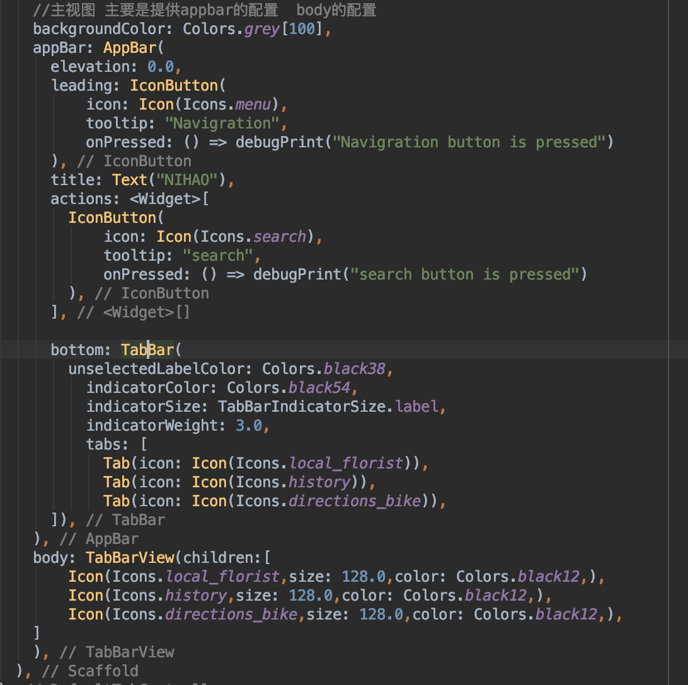
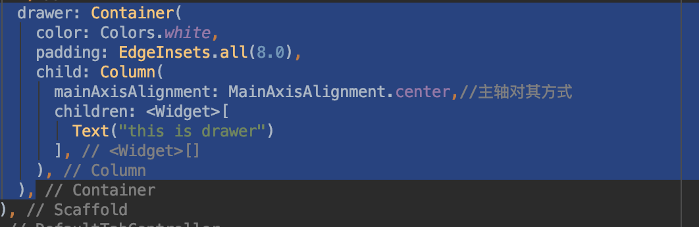
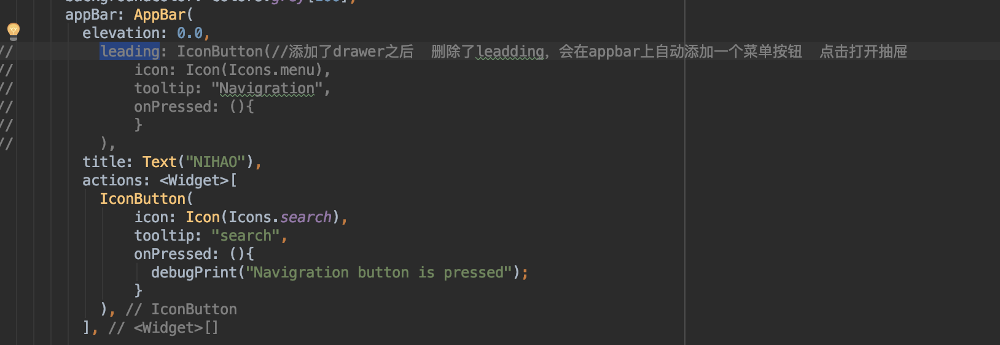
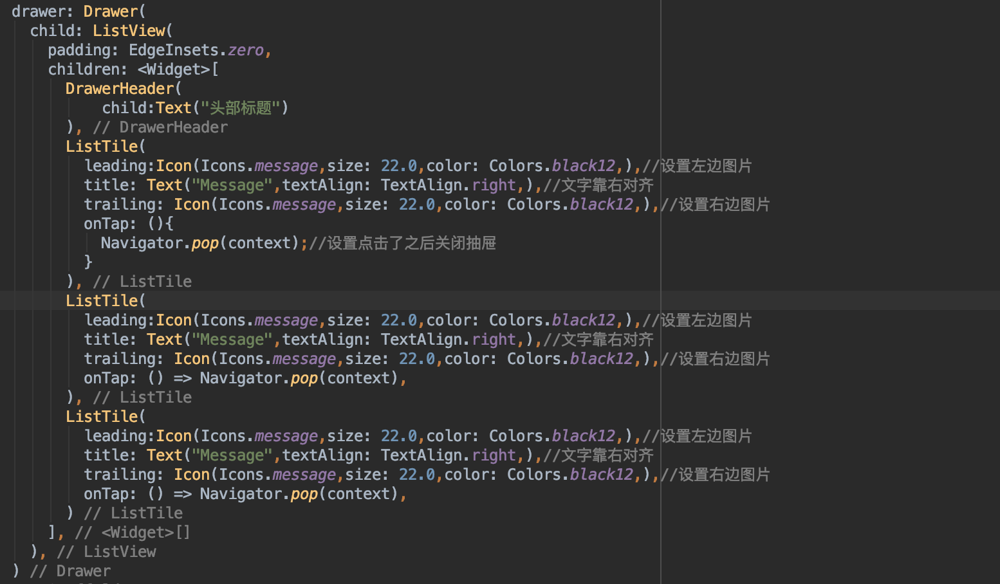
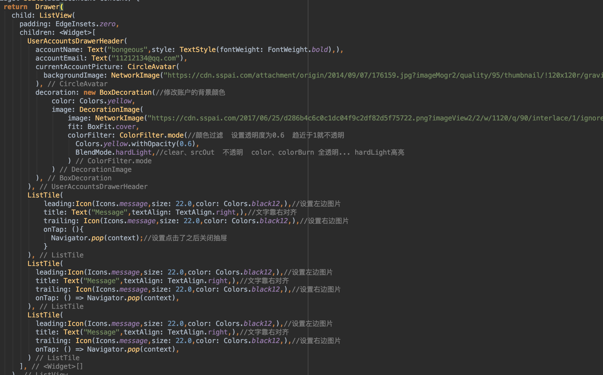
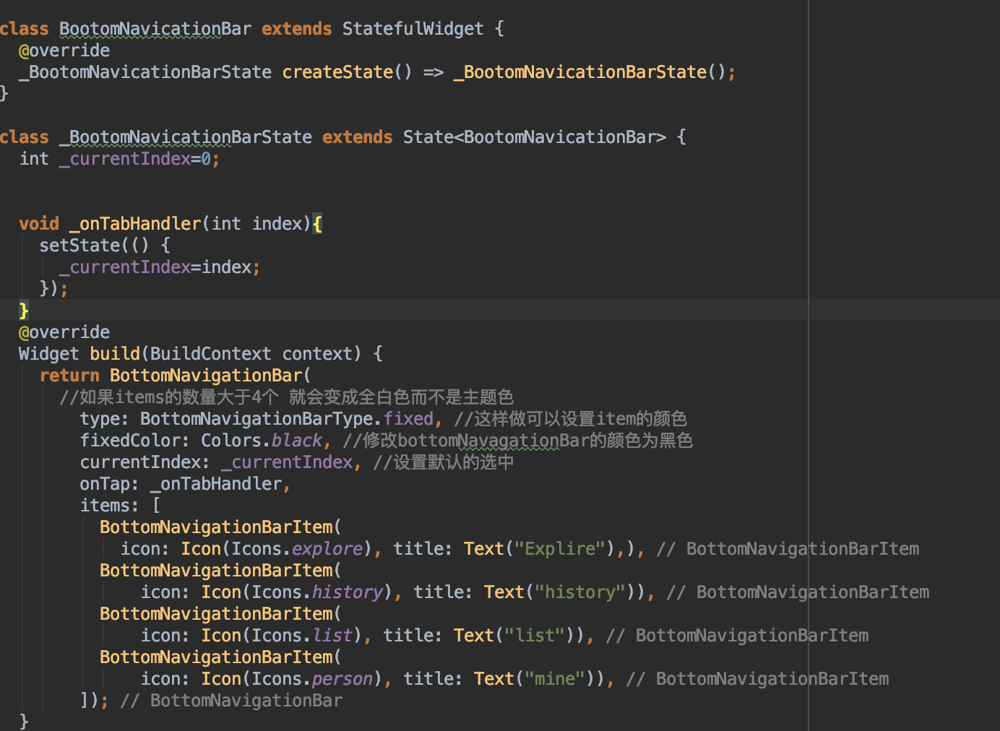
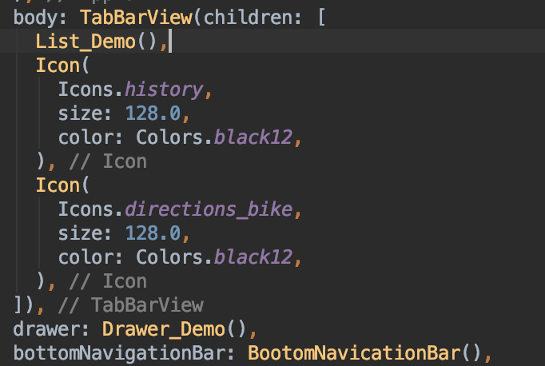

# nihao_flutter

A new Flutter application.

## Getting Started

This project is a starting point for a Flutter application.

A few resources to get you started if this is your first Flutter project:

- [Lab: Write your first Flutter app](https://flutter.io/docs/get-started/codelab)
- [Cookbook: Useful Flutter samples](https://flutter.io/docs/cookbook)

For help getting started with Flutter, view our 
[online documentation](https://flutter.io/docs), which offers tutorials, 
samples, guidance on mobile development, and a full API reference.


#### flutter开发 使用google MaterialApp主题

1.  runAPP()中填写主视图类
    ```
    void main() => runApp(MyApp());
    ```
2. MyApp中大多都继承自无状态控件StatelessWidget，在返回的时候返回MaterialApp(),MaterialAPP()中能配置的参数为：
    ```
    debugShowCheckedModeBanner: false, //右上角的debug的显示
     title: 'Flutter Demo',
    theme: ThemeData(
        primarySwatch: Colors.yellow, //只有在MaterApp中配置主题
        highlightColor: Color.fromRGBO(255, 255, 255, 0.5),
          splashColor: Colors.white70
      ),
      home: Home(), //设置主页面
    ```
3. 在Home类中写主页面视图 ，大多继承自stateless,在返回时返回Scaffold(),Scaffold()中能配置appbar，body等



##### 使用抽屉drawer
   **在scaffold()中使用**

*    1 简单使用



*   2  配合listviewlistTitle和DrawerHeader使用

     **删除appbar中的leading 如果有drawer属性会自动在appbar中生成一个菜单图标 点击可打开菜单**

     
    


* 使用用户信息作为头部


##### 使用底部导航栏
   **属性：bottomNavigationBar**
   BottomNavigation应设置成动态控件 因为需要用户点击去切换选项卡

   
   在选项卡部分 可以直接替换成list列表页面
    


