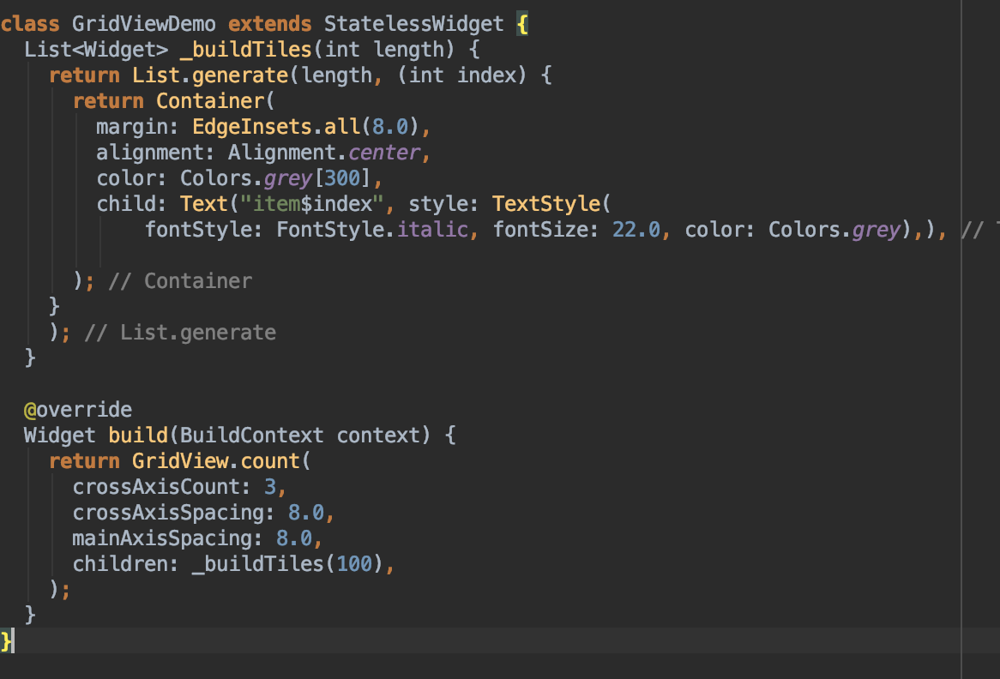
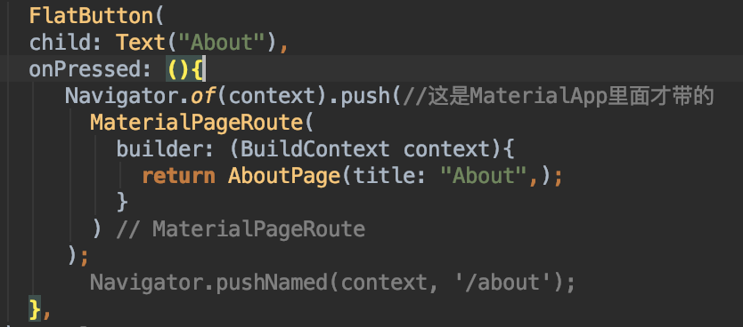
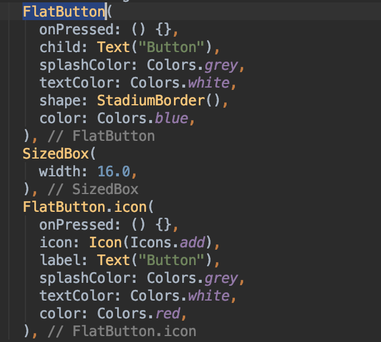
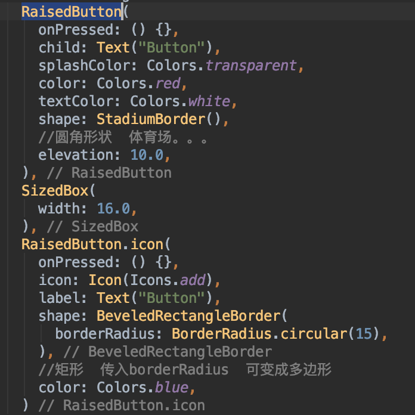

7#### flutter开发 使用google材质主题

1.  runAPP()中填写主视图类
    ```
    void main() => runApp(MyApp());
    ```
2. MyApp中大多都继承自无状态控件StatelessWidget，在返回的时候返回MaterialApp(),MaterialAPP()中能配置的参数为：
    ```
    debugShowCheckedModeBanner: false, //右上角的debug的显示
     title: 'Flutter Demo',
    theme: ThemeData(
        primarySwatch: Colors.yellow, //只有在MaterApp中配置主题
        highlightColor: Color.fromRGBO(255, 255, 255, 0.5),
          splashColor: Colors.white70
      ),
      home: Home(), //设置主页面
    ```
3. 在Home类中写主页面视图 ，大多继承自stateless,在返回时返回Scaffold(),Scaffold()中能配置appbar，body等


##### 使用抽屉drawer
   **在scaffold()中使用**

*    1 简单实用


*   2  配合listviewlistTitle和DrawerHeader使用

     **删除appbar中的leading 如果有drawer属性会自动在appbar中生成一个菜单图标 点击可打开菜单**
     
     
     

* 使用用户信息作为头部


##### 使用底部导航栏
   **属性：bottomNavigationBar**
   BottomNavigation应设置成动态控件 因为需要用户点击去切换选项卡
   
   
   在选项卡部分 可以直接替换成list列表页面
   
   
   
   
####   文本样式

*     文字样式 对齐方式 文字打下 字体颜色等设置方式


* 富文本设置方式

#### Container以及BoxDecoration等属性


#### PageView的使用

* 直接使用PageView控件


* 使用PageView.builder()


#### GridView的使用

*     使用GridView.count()
    

*     使用GridView.extent()


*  使用GridView.Build()


#### Sliver 使用

* 使用SliverGrid  放在CustomScrollView中


* 使用SliverList 


* 使用SliverAppBar
    
####    使用navigator 导航 

* 简单使用  如果页面有上一级页面。会主动在appBar上显示一个返回键


* 使用 Navigator.pushNamed()
  **在maerialApp()中增加routes()字段和initialRoute字段，initialRoute字段作用是打开时显示的主界面。**
  **在routes字段中，用一个集合表示按照名字的路由集合。“/”表示主界面，按下返回键依旧会返回到主界面** 
    
    
    
    

*  返回上一页面
```
   Navigator.pop(context)；
 //Navigator.of(context).pop();
```

#### 主题 
    “需要在控件中设置主题Color”
*  修改某些页面的主题


* 修改页面主题


* 修改部分主题  其他的不变


#### 文本输入控件


*  添加textFiled的控制器
    
        **在initState()方法中添加监听器  在dispose()方法中销毁掉TextEditingController,否则会消耗性能**
        
####  表单


 **在TextFormFiled中有一个onSave()方法。点击完成时候 会获取控件中的值给GlobalKey**

*  保存和获取表单数据


* 验证表单数据
    1. 在TextFormFiled中加入validator属性，添加方法 


    2. 在按钮点击的时候。去验证一下表单数据
    
     **_registerSave在RaiseButton中的onPressed属性中添加了**
   3.自动验证表单
   **在TextFormFiled中添加autovalidate，新建一个bool ifautovalidate = false;给autovalidate作为值，然后根据情况去判断**


  4. SnackBar使用方法
  
```
Scaffold.of(context).showSnackBar(SnackBar(content: Text("Registering....")));
```

#### 按钮的使用

* floatingActionButton的使用


* FlatButton的使用


* RaisedButton的使用


* OutlineButton的使用


* 按钮占用宽度的设置


* 占满所有的空间


* 水平平均分的按钮 ButtonBar


#### 弹出式菜单的使用。
**一般结合appbar里面的actions属性使用**


#### DateTime的使用

**设置默认显示的日期为当天 最小日期为2018-12-4。最大日期为2019-1-1**


#### TimeOfDay的使用

**设置默认显示时间为现在**

#### 对话框的使用

1. simpleDialog
    * 创建枚举类
            ```
            enum Option { A, B, C }
            ```
    * 使用RaiseButton的点击事件进行对话框弹出   
        ```
         RaisedButton(
                onPressed: _showDialog,
                child: Text("显示对话框"),
                color: Colors.blue,
                textColor: Colors.white,
                shape: StadiumBorder(),
                elevation: 5.0,
                highlightElevation: 0.0,
                )
        ```

      * 显示对话框 并获取点击的值
      
**SimpleDialog的children是：SimpleDialogOption**


2. 使用AlertDialog

* 创建枚举类 
    `enum Result {
      ok,
      cancle,
    }`
    
    

*   使用floatingActonButton弹出对话框


* 显示对话框并获取点击的值


3. 使用BottomSheetDialog 
    * 创建全局变量
    `var _bottomSheetGloablKey =GlobalKey<ScaffoldState>();`
    * 使用RaiseButton来弹出对话框
        
    * 显示对话框
    
    *bottomSheetDialog弹出后 不会主动消失 主界面也可以点击  对话框也可以点击操作*
    
    
4. 使用ModalBottomSheet

*ModalBottomSheet从底部弹出 弹出后不能操作主界面*

####  ExpansionPanel 可折叠的布局 

*     ExpansionPanel的单独使用


* 多个一起使用
    1. 第一步创建类、填充数据
    
    2. 显示
    
    


 
    


    
    


    

    


     


